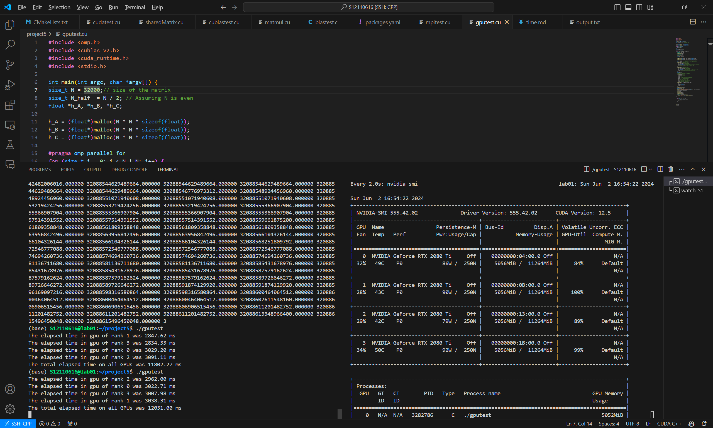
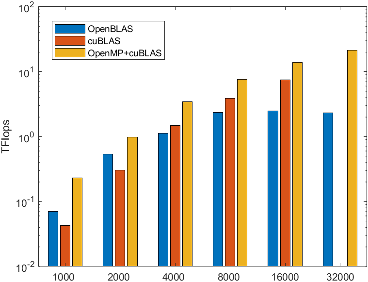
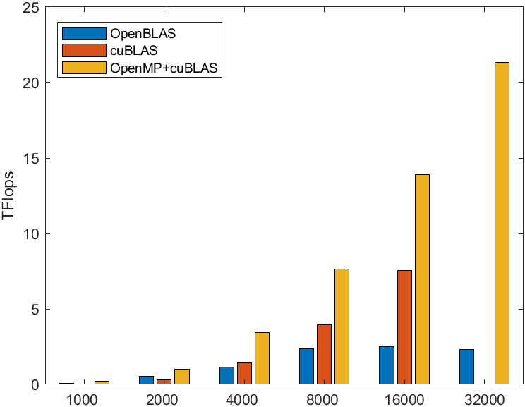

# CUDA
## Task 1
Implement the expression B = a A + b, where a and b are scalars, A and B are matrices of the same size.

My implement works as followed:
```c
#include <stdio.h>
#include <sys/time.h>


__global__ void myKernel(float* A, float* B, float a, float b, int width, int height) {
    int idx = blockIdx.x * blockDim.x + threadIdx.x;
    int idy = blockIdx.y * blockDim.y + threadIdx.y;

    if (idx < width && idy < height) {
        int index = idy * width + idx;
        B[index] = a * A[index] + b;
    }
}

int main(void) {
// Rest of the code ...

dim3 dimBlock(16, 16);
dim3 dimGrid((n + dimBlock.x - 1) / dimBlock.x, (n + dimBlock.y - 1) / dimBlock.y);
myKernel<<<dimGrid, dimBlock>>>(d_A, d_B, alpha, beta, n, n);

// Rest of the code ...
}
```

This is in fact a sub function of `cublasSgemm()`, so we can achieve the same purpose by running
```c
cublasHandle_t handle;
cublasSgemm(handle, CUBLAS_OP_N, CUBLAS_OP_N, n, n, n, &alpha, d_A, n, d_B, n, &beta, d_B, n);
```
here `CUBLAS_OP_N` means no operation.

## Comparison between `cuBLAS` and `OpenBLAS`
### `OpenBLAS`
#### Installing `OpenBLAS`
Since I wish to test on my own computer as well, I decide to install my own OpenBLAS
```bash
wget https://github.com/OpenMathLib/OpenBLAS/releases/download/v0.3.27/OpenBLAS-0.3.27.tar.gz
tar -xvf OpenBLAS-0.3.27.tar.gz
mkdir openblas
cd OpenBLAS-0.3.27
make PREFIX=/data/S12110616/openblas -j 32 install
```
then we can use the installed `OpenBLAS` library.
#### Program using `OpenBLAS`
```c
#include <stdio.h>
#include <stdlib.h>
#include <cblas.h>
#include <sys/time.h>
#include <omp.h>

int main() {
    int n = 8000;

    // Initialize matrices A and B
    float *A = (float *)aligned_alloc(32, n * n * sizeof(float));
    float *B = (float *)aligned_alloc(32, n * n * sizeof(float));
    float *C = (float *)aligned_alloc(32, n * n * sizeof(float));

    // Check if the memory was allocated successfully
    if (A == NULL || B == NULL || C == NULL) {
        printf("Memory allocation failed\n");
        return 1;
    }

    #pragma omp parallel for
    for (int i = 0; i < n * n; i++) {
        A[i] = 1.0;
        B[i] = 2.0;
        C[i] = 0.0;
    }

    // Perform matrix multiplication C = A * B
    struct timeval start, end;
    gettimeofday(&start, NULL);
    cblas_sgemm(CblasRowMajor, CblasNoTrans, CblasNoTrans, n, n, n, 1.0, A, n, B, n, 0.0, C, n);
    gettimeofday(&end, NULL);
    double time = (end.tv_sec - start.tv_sec) + (end.tv_usec - start.tv_usec) / 1000000.0;
    printf("Time: %f\n", time);

    // Print the result
    if (n < 10){
        for (int i = 0; i < n; i++) {
            for (int j = 0; j < n; j++) {
                printf("%f ", C[i * n + j]);
            }
            printf("\n");
        }
    }
    // Free the memory
    free(A);
    free(B);
    free(C);

    return 0;
}
```
compile the program with `gcc blastest.c -o blastest -lopenblas -fopenmp`
For $n=8000$:
```bash
Time: 0.471499
```
For $n=16000$:
```bash
Time: 3.384995
```
<!-- For $n=32000$:
```bash
Time: 42.738154
``` -->
### `cuBLAS`
`cublasSgemm` is also used in the matrix multiplication of `cuBLAS`
```c++
#include <iostream>
#include <cublas_v2.h>
#include <cuda_runtime.h>

int main() {
    cublasHandle_t handle;
    float* d_A, *d_B, *d_C;
    float* h_A, *h_B, *h_C;
    int n = 16000;

    h_A = (float*)malloc(n * n * sizeof(float));
    h_B = (float*)malloc(n * n * sizeof(float));
    h_C = (float*)malloc(n * n * sizeof(float));

    // Initialize matrices A and B
    for (int i = 0; i < n * n; i++) {
        h_A[i] = 1.0;
        h_B[i] = 1.0;
        h_C[i] = 0.0;
    }

    cudaEvent_t start, stop;
    cudaEventCreate(&start);
    cudaEventCreate(&stop);
    cudaEventRecord(start);

    // Initialize cuBLAS
    cublasCreate(&handle);

    // Allocate device memory
    cudaMalloc((void**)&d_A, n * n * sizeof(float));
    cudaMalloc((void**)&d_B, n * n * sizeof(float));
    cudaMalloc((void**)&d_C, n * n * sizeof(float));


    // Copy matrices A and B to the device
    cudaMemcpy(d_A, h_A, n * n * sizeof(float), cudaMemcpyHostToDevice);
    cudaMemcpy(d_B, h_B, n * n * sizeof(float), cudaMemcpyHostToDevice);

    // Perform matrix multiplication C = A * B
    float alpha = 1.0f;
    float beta = 0.0f;
    cublasSgemm(handle, CUBLAS_OP_N, CUBLAS_OP_N, n, n, n, &alpha, d_A, n, d_B, n, &beta, d_C, n);

    // Copy the result back to host
    cudaMemcpy(h_C, d_C, n * n * sizeof(float), cudaMemcpyDeviceToHost);

    cudaEventRecord(stop);

    // Calculate the elapsed time
    float milliseconds = 0;
    cudaEventElapsedTime(&milliseconds, start, stop);
    std::cout << "Elapsed time: " << milliseconds << " ms\n";

    // Print the result
    if (n < 10){
        for (int i = 0; i < n; i++) {
            for (int j = 0; j < n; j++) {
                std::cout << h_C[i * n + j] << " ";
            }
            std::cout << "\n";
        }
    }
    // Cleanup
    cudaFree(d_A);
    cudaFree(d_B);
    cudaFree(d_C);
    cublasDestroy(handle);

    return 0;
}
```
then compile the program with `nvcc -lcublas cublastest.cu -o cublastest`
For $n=8000$:
```bash
Elapsed time for GEMM: 95.5881 ms
Elapsed time: 259.761 ms
```
For $n=16000$:
```bash
Elapsed time for GEMM: 547.825 ms
Elapsed time: 1085.15 ms
```
For $n=32000$:
```bash
CUDA error: invalid argument
Elapsed time for GEMM: 547.825 ms
Elapsed time: 1085.15 ms
```
we can see that the size of the matricies are too large to be fitted into a single GPU when $n=32000$.
here the elapsed time includes the time used for allocating vram and copying.


## `OpenMP` + `cuBLAS`
In the previous section, we have tried to perform matrix multiplication on a single GPU. However, since our cluster has 4 gpu in total, it occurs to me that we can try to perform matrix multiplication across 4 GPUs.

My implementation is originated from [an example on github](https://github.com/ChristosMatzoros/CUDA-MultiGPU-Tiled-Matrix-Multiplication-using-CUDA-Streams/blob/main/matrixMulMultiGPU.cu), it the commented part, the author wrote:
```
------------------------------------------------
A * B = C   

|  A1  |     |    |    |       C1 | C2
-------- *   | B1 | B2 |   =   -------
|  A2  |     |    |    |       C3 | C4 

A1 * B1 = C1
A1 * B2 = C2
A2 * B1 = C3
A2 * B2 = C4

These 4 computations may take place simultaneously on 4 different GPUs.
------------------------------------------------
```
which can also be used on our cluster.

my implementation is as followed:
```c
#include <omp.h>
#include <cublas_v2.h>
#include <cuda_runtime.h>
#include <stdio.h>

int main(int argc, char *argv[]) {
size_t N = 32000;// size of the matrix
size_t N_half  = N / 2; // Assuming N is even
float *h_A, *h_B, *h_C;

h_A = (float*)malloc(N * N * sizeof(float));
h_B = (float*)malloc(N * N * sizeof(float));
h_C = (float*)malloc(N * N * sizeof(float));

#pragma omp parallel for
for (size_t i = 0; i < N * N; i++) {
    h_A[i] = 1.0f * i;
    h_B[i] = 1.0f * i;
}

float totalMilliseconds = 0;

#pragma omp parallel for
for (int taskid = 0; taskid < 4; taskid++) {
    cudaSetDevice(taskid); // set the device
    cudaEvent_t start, stop;
    cudaEventCreate(&start);
    cudaEventCreate(&stop);

    cublasHandle_t handle;
    cublasCreate(&handle);

    float *d_A, *d_B, *d_C;
    size_t pitch_A, pitch_B, pitch_C;

    cudaEventRecord(start);
    cudaMallocPitch((void**)&d_A, &pitch_A, N_half * sizeof(float), N);
    cudaMallocPitch((void**)&d_B, &pitch_B, N * sizeof(float), N_half);
    cudaMallocPitch((void**)&d_C, &pitch_C, N_half * sizeof(float), N_half);

    int col = taskid / 2; //  Determine the column of the submatrix (0 or 1)
    int row = taskid % 2; //  Determine the row of the submatrix (0 or 1)

    cudaMemcpy2D(d_A, // destination pointer
        N_half * sizeof(float), // pitch of the destination
        h_A + col * N_half,  // source pointer 
        N * sizeof(float), // pitch of the source
        N_half * sizeof(float), // height of the source, or number of rows to copy
        N, // width of the source, or number of columns to copy
        cudaMemcpyHostToDevice // direction of the copy
    );
    
    cudaMemcpy2D(d_B, // destination pointer
        N * sizeof(float), // pitch of the destination
        h_B + row * N * N_half,  // source pointer 
        N * sizeof(float), // pitch of the source
        N * sizeof(float), // height of the source, or number of rows to copy
        N_half, // width of the source, or number of columns to copy
        cudaMemcpyHostToDevice // direction of the copy
    );
    float alpha = 1.0f;
    float beta = 0.0f;

    // Perform the multiplication on a sub-matrix
    cublasSgemm(handle, 
        CUBLAS_OP_N, // transa
        CUBLAS_OP_N, // transb
        N_half, // m
        N_half, // n
        N, // k
        &alpha, // alpha, scalar used for multiplication 
        d_A, // A
        N_half, // lda, leading dimension of A
        d_B, // B
        N, // ldb, leading dimension of B
        &beta, // beta, scalar used for addition
        d_C, // C, output matrix
        N_half// ldc, leading dimension of C
    );
    cudaMemcpy2D(h_C + row * N_half * N + col * N_half,
        N * sizeof(float),
        d_C,
        N_half * sizeof(float),
        N_half * sizeof(float),
        N_half,
        cudaMemcpyDeviceToHost
    );
    cudaEventRecord(stop);
    cudaEventSynchronize(stop);

    float milliseconds = 0;
    cudaEventElapsedTime(&milliseconds, start, stop);
    printf("The elapsed time in gpu of rank %d was %.2f ms\n", taskid, milliseconds);
    totalMilliseconds += milliseconds;
    cudaFree(d_A);
    cudaFree(d_B);
    cudaFree(d_C);
    cublasDestroy(handle);
    cudaEventDestroy(start);
    cudaEventDestroy(stop);
    cudaError_t err = cudaGetLastError();
    if (err != cudaSuccess) {
        printf("CUDA error: %s\n", cudaGetErrorString(err));
    }
}
printf("The total elapsed time on all GPUs was %.2f ms\n", totalMilliseconds);

if (n < 10){
    for (size_t i = 0; i < N; i++) {
        for (size_t j = 0; j < N; j++) {
            printf("%f ", h_C[i * N + j]);
        }
        printf("\n");
    }
}

free(h_A);
free(h_B);
free(h_C);
}
```
here I use `#pragma omp parallel for` to create 4 seperate threads, and then use `cudaSetDevice(taskid);` to bind the GPU devices with corresponding threads. I have tried to use GPU in previous project, so I learned that cuda has a dedicated function `cudaMemcpy2D` that can be used to copy sub-matricies:
```c
cudaMemcpy2D(d_A, // destination pointer
    N_half * sizeof(float), // pitch of the destination
    h_A + col * N_half,  // source pointer 
    N * sizeof(float), // pitch of the source
    N_half * sizeof(float), // height of the source, or number of rows to copy
    N, // width of the source, or number of columns to copy
    cudaMemcpyHostToDevice // direction of the copy
);
```
all I need to do is to set the pitches of the matricies. then I can perform `cublasSgemm` on all GPUs.


### Result
I used `nvcc -lcublas -Xcompiler -fopenmp gputest.cu -o gputest` to compile the program with $N=32000$

from the screen shot we can see that the program is able to utilize all four GPUs and perform matrix multiplication that can not be done on a single GPU.
## Comparison


The figure measure the speed by TFlops, tera floating point operation per second.
From the figure we can observe that `OpenBLAS` is faster then `cuBLAS` on single GPU when the size of the matrix is small, since it does not have to move the data back and forth, but the GPU catches up as the size of the matrix grows, because the transfer time increases by $O(N^2)$, while the time complexity of the multiplication increases $O(N^3)$. However, since the server memory is much larger than VRAM, `OpenBLAS` can compute matrix whose size is larger. 

I also observe that although `OpenMP` + `cuBLAS` is using 4 GPU, the floating point performance is only about twice faster than a single GPU, suggesting that there are still many rooms to improve.

### Future Work
During the project, I have tried to use `OpenMPI` to speed up the process, I managed to install `OpenMPI` with cuda using `spack` because I am not a sudoer, but it seems like mpirun will start multiple processes instead of threads, and each processes will have dedicated memory. I have yet to figure out how to share the memory between processes, thus I could not write a matrix multiplication program using `OpenMPI`, this is something I will try in the future.

I am not sure whether it is permission problem or I am not allocating memory correctly, but my program fails to allocate memory for $N=64000$, despite it has about 100G of free memory, I will try to test for larger matrix after the deadline.

CUDA provided an API called `cudaMallocManaged`, which will provide unified memory between CPU and GPU, which is simpler to manage and avoid cuda out of memory. I will try to use this to implement a new matrix class in the summer vacation.